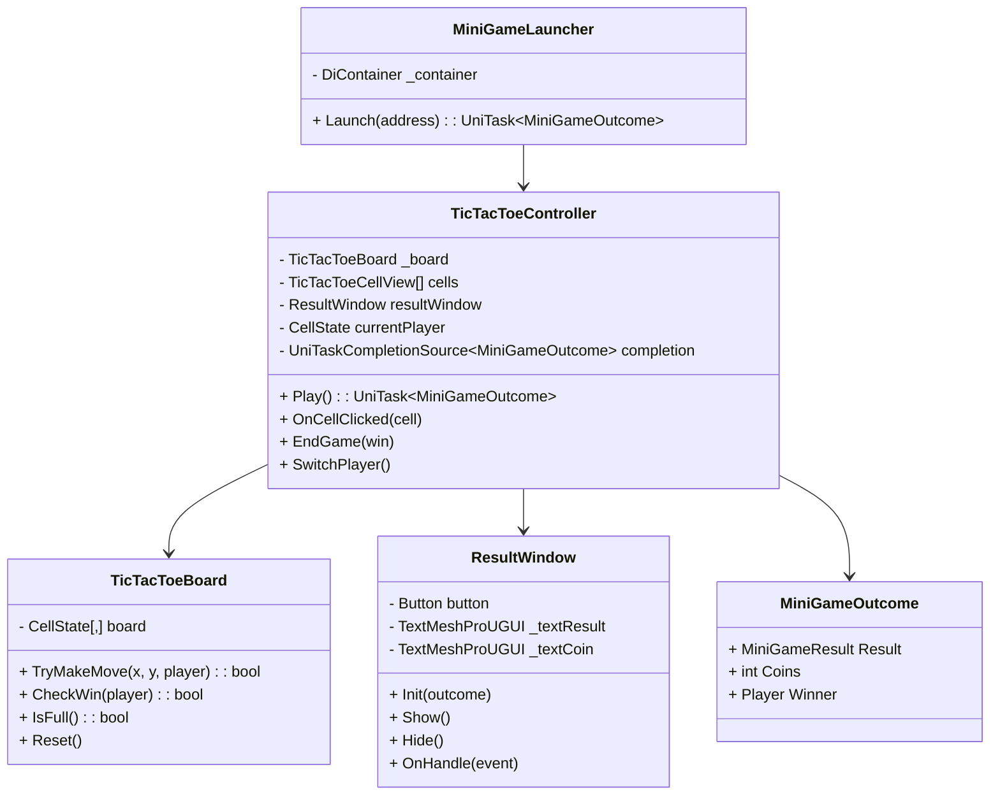

# 🎮 MiniGame: TicTacToe

Миниигра **Крестики-нолики**, реализованная как независимый модуль, запускаемый из любой другой игры через `MiniGameLauncher`.

---

## 📋 Описание

- Полноценные крестики-нолики с победой, поражением и ничьей
- UI с окном результата: показ победителя и награды (Coins)
- Возможность рестарта игры
- Запуск через **Addressables** и **Zenject**, результат возвращается через **UniTask**
- Класс `TicTacToeBoard` — не MonoBehaviour (логика отделена от Unity)
- Рефакторинг кода выполнялся с помощью **Cursor** (VS / JetBrains Rider)

---

## 🏗️ Архитектура

### UML-диаграмма



---

## 🤖 ИИ-агент

Встроенный простой ИИ-агент для выбора ходов реализует следующую логику:

1. **Победный ход** — если есть возможность выиграть, агент выбирает эту клетку
2. **Блокировка** — если противник может выиграть следующим ходом, агент блокирует его
3. **Случайный ход** — в остальных случаях выбирается случайная пустая клетка

Агент настраивается через встроенный воркфлоу. Цель — продемонстрировать процесс постановки задачи ИИ, проверки результата и корректного выполнения хода.

---

## 💬 Примеры промптов для Cursor / LLM

### Разделение логики и представления (Pure C# vs MonoBehaviour)
```
В проекте есть класс TicTacToeController : MonoBehaviour, который содержит
как игровую логику (проверка победителя, смена хода), так и UI-код.
Вынеси игровую логику в отдельный pure C# класс TicTacToeBoard без
наследования от MonoBehaviour. Контроллер должен использовать его как
зависимость. Сохрани текущий публичный API.
```

### Архитектура миниигры через интерфейс
```
Реализуй интерфейс IMiniGame с методом UniTask<MiniGameOutcome> Play().
TicTacToeController должен его реализовывать. MiniGameLauncher должен
загружать префаб через Addressables, резолвить IMiniGame через Zenject
и вызывать Play(). Покажи полную цепочку: регистрация в инсталлере,
биндинг, запуск.
```

### Паттерн Command для ходов игрока
```
Оберни каждый ход в объект команды, реализующий интерфейс IMoveCommand
с методами Execute() и Undo(). TicTacToeController должен хранить стек
команд и поддерживать откат хода. Покажи, как это интегрируется с
текущим TicTacToeBoard.
```

### Async-флоу с UniTask и окном результата
```
Метод Play() в TicTacToeController должен:
1. Ждать хода игрока или агента через UniTaskCompletionSource
2. После завершения игры показывать ResultWindow
3. Ждать нажатия кнопки в окне перед возвратом MiniGameOutcome
Покажи корректную цепочку await без утечек и race condition.
```

### Расширение MiniGameLauncher для нескольких миниигр
```
MiniGameLauncher сейчас жёстко привязан к TicTacToe. Рефактори его так,
чтобы он мог загружать любую миниигру по Addressables-адресу, резолвить
её через Zenject как IMiniGame и возвращать MiniGameOutcome. Новые
миниигры не должны требовать изменений в Launcher.
```

---

## 🔧 Ручные исправления и доработки

В процессе разработки потребовалось вручную доработать ряд аспектов:

| Проблема | Решение |
|---|---|
| Установка родителя prefab'а через Zenject | Нельзя менять Transform у ассета — использован инстанс |
| Логика `Board` и проверка победителя | Переписаны для работы без MonoBehaviour |
| Окно результата и кнопка рестарта | Добавлены вручную; `Play()` ожидает закрытия окна перед возвратом |
| Передача победителя в `MiniGameOutcome` | Логика `Winner` добавлена вручную |
| Рефакторинг | Использован Cursor: перемещение полей, переименование, перенос методов между классами |

---

## 🛠️ Стек технологий

- **Unity** — движок
- **Zenject** — DI-контейнер
- **Addressables** — загрузка ассетов
- **UniTask** — асинхронность
- **TextMeshPro** — UI-текст
- **Cursor** — AI-рефакторинг кода
